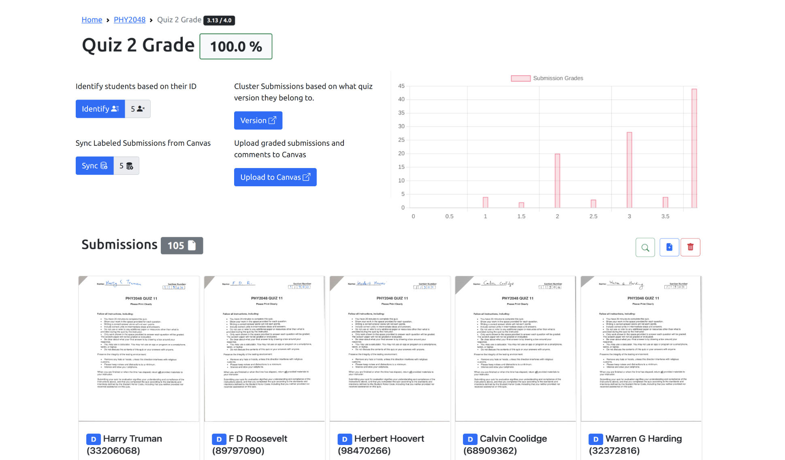

[](https://github.com/IonMich/instructor_pilot/actions/workflows/python-package-conda.yml)

# Instructor Pilot


## Description

A Django app to assist Teaching Assistants and Instructors with Canvas integration.

It depends on the [canvasapi](https://github.com/ucfopen/canvasapi) library and on its wrapper [autocanvas](https://github.com/IonMich/autocanvas).

## Installation

- Install [conda](https://docs.anaconda.com/anaconda/install/windows/) via the official instructions for your OS. If you would like a more lightweight installation, you can use alternatively [miniconda](https://docs.conda.io/en/latest/miniconda.html).
- Clone this repository at your desired location by running:

   ```shell
   git clone https://github.com/IonMich/instructor_pilot.git
   cd instructor_pilot
   ```

- Create a conda environment:

   ```shell
   conda env create --file environment.yml --name django-ta
   ```

   This will take approximately 20 minutes on Windows and 5 minutes on Unix-based systems. You can replace `django-ta` with the environment name of your choice above and in what follows.
- Activate the environment:

   ```shell
   conda activate django-ta
   ```

- Your cloned repository contains a file named `.env.example` which contains four environment key-value pairs. Rename the file to `.env` (*without* `.txt`), and edit the values of the following keys:
  - `API_URL` : The URL of your Canvas instance of your institution. If you are a UF member, use `"https://ufl.instructure.com/"`.
  - `API_KEY` : To connect to Canvas, you will need to create a Canvas API token. You can do this by going to your Canvas Account Settings and clicking on the `New Access Token` button of the "Approved Integrations" section. Copy this token and paste it in the `.env` file as the value of the `API_KEY` key.
  - `DJANGO_SECRET_KEY` : This is a secret key used by Django to encrypt data. You can generate one by running the following command in your terminal:

    ```shell
    python -c 'from django.core.management.utils import get_random_secret_key; print(get_random_secret_key())'
    ```

  - `ENV_TYPE` : This should be set to `"dev"`. No need to change it.

- Initialize the Django app by adding a username and password for the admin account:

   ```shell
   python manage.py makemigrations
   python manage.py migrate
   python manage.py createsuperuser
   ```

- Run the Django app:

   ```shell
   python manage.py runserver
   ```

- Open your browser and go to `http://127.0.0.1:8000/admin/auth/user/1/change/`. Log in with the username and password you created in the previous step. Then add your information in the `First name` and `Last name` fields and save it - your last name will be used if you are UF member to get your section class meeting times from the UF API. Feel free to add your institutional email address in the `Email address` field as well.

- Go to `http://127.0.0.1:8000/admin/universities/university/add/` and add your university. Use `ufl`
as the university code if you are a UF member.

- All set! You can now go to `http://127.0.0.1:8000/` to add a course and start using the app.

# Usage

The instructions above need to be followed only once. After that, you can run the app by simply navigating to the `instructor_pilot` directory and running:

   ```shell
   conda activate django-ta
   python manage.py runserver
   ```
